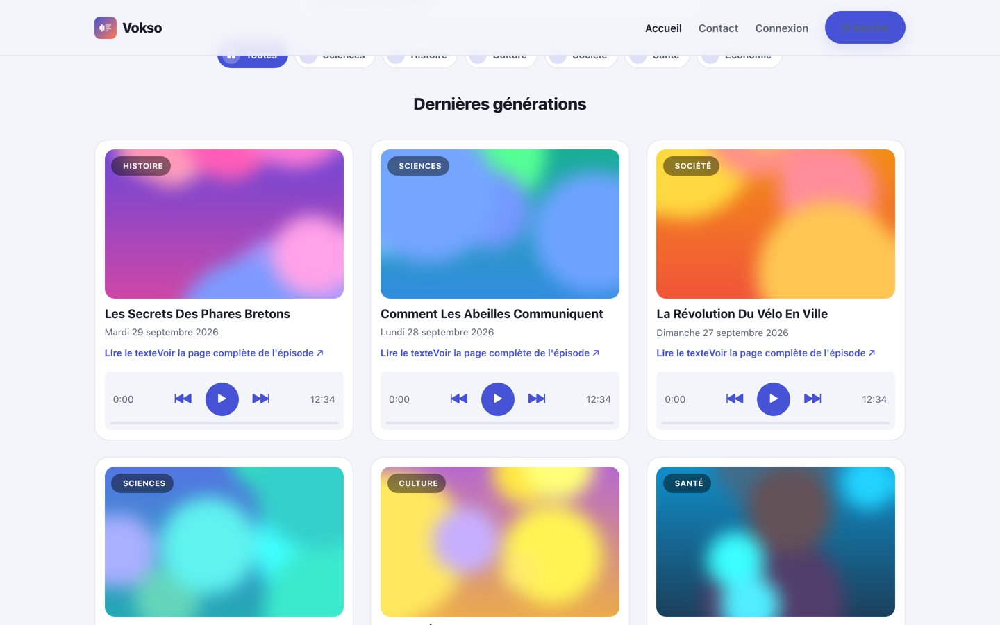
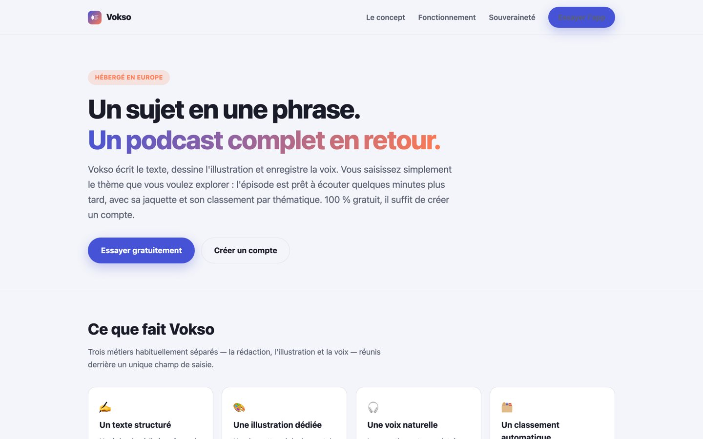
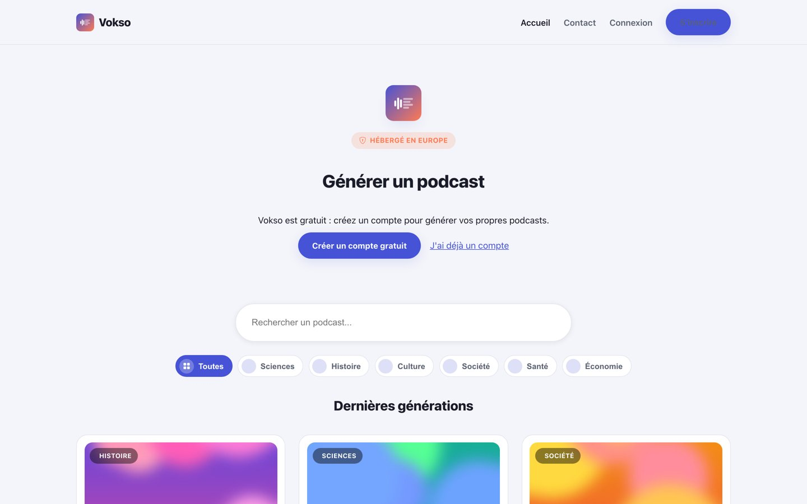

# Vokso

Vokso transforme un sujet (une phrase, ou un message vocal) en épisode de podcast complet : un texte de narration en français, une illustration et une voix de synthèse, générés par IA en quelques minutes. Le service est **gratuit** ; il faut un compte pour générer, avec un nombre limité de générations par mois pour éviter les abus.

Production : [vokso.fr](https://vokso.fr)

## Aperçu

*Captures en local ; les épisodes, catégories et illustrations affichés sont fictifs.*



| Vitrine | Page de génération |
| --- | --- |
|  |  |

## Architecture

| Dossier | Rôle | Technologies |
| --- | --- | --- |
| `site/` | Vitrine statique (racine du domaine), réécritures SEO (`site/.htaccess`) | HTML/CSS |
| `webserver/src/` | Application web, servie sous `/app/` | React 18 + TypeScript (Create React App) |
| `webserver/api/` | API servie sous `/api/`, pages épisode rendues côté serveur (`/podcast/...`), sitemap | Laravel 13 (PHP 8.3) |
| `apache-config/` | Vhost Apache versionné, synchronisé à chaque déploiement | Apache 2.4 |
| `SQL/` | Historique des migrations de la base de production (appliquées à la main) | MySQL |
| `scripts/` | Déploiement, provisionnement du serveur, sauvegardes | Bash |

### Génération d'un podcast

1. Le front envoie le sujet (`POST /api/generation`) ou un fichier audio (`POST /api/generation-audio`), avec le jeton de connexion.
2. L'API vérifie les limites anti-abus (par adresse IP et quota mensuel par compte, voir `App\Support\GenerationQuota`), crée un job et lance en arrière-plan `php artisan vokso:process-job {id}`.
3. `App\Services\PodcastGenerator` enchaîne : transcription éventuelle → texte, titre et catégorie en parallèle → illustration et voix en parallèle → enregistrement.
4. Le front suit la progression via `GET /api/generation-status?id=...`.

Toutes les étapes d'IA passent par **Mistral AI** (texte avec recherche web, génération d'image, synthèse vocale Voxtral, transcription Voxtral). Le texte peut aussi passer par Ollama Cloud (`AI_TEXT_PROVIDER=ollama`).

## Développement local

Prérequis : Docker et Node.js 20 (PHP 8.3+ et Composer en local pour lancer les tests de l'API).

```bash
# Base de données, Apache et MailHog
cp .env.example .env                        # identifiants MySQL locaux
cp webserver/api/.env.example webserver/api/.env
docker compose up -d

# API (Laravel), dans le conteneur web (DB_HOST=db)
docker compose exec -w /var/www/html/webapp/api web composer install
docker compose exec -w /var/www/html/webapp/api web php artisan key:generate
docker compose exec -w /var/www/html/webapp/api web php artisan migrate --seed   # schéma + prompts par défaut
docker compose exec -w /var/www/html/webapp/api web php artisan vokso:create-admin vous@exemple.fr

# Front (React + TypeScript)
cd webserver
npm ci
npm start
```

Variables du front (`webserver/.env`) : `REACT_APP_API_URL` (ex. `http://localhost/api`) et `REACT_APP_STATIC_URL` (ex. `http://localhost`), `REACT_APP_SENTRY_DSN` optionnelle.

La génération nécessite une clé `MISTRAL_API_KEY` dans `webserver/api/.env`.

## Tests

```bash
cd webserver/api && vendor/bin/phpunit          # API (SQLite en mémoire)
cd webserver && npm run typecheck && npm test   # Front
```

La CI GitHub Actions (`.github/workflows/ci.yml`) lance ces vérifications et le build à chaque push.

## Déploiement

Un push sur la branche `production` déclenche la CI puis, si elle réussit, le déploiement (`.github/workflows/deploy.yml` → `scripts/deploy.sh` sur le serveur). Détails : [docs/DEPLOIEMENT.md](docs/DEPLOIEMENT.md). Sauvegardes : [docs/BACKUP.md](docs/BACKUP.md).
